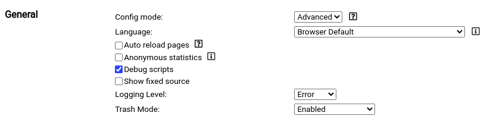
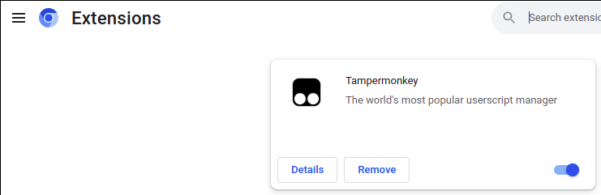
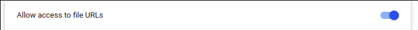

# Instructions for writing and debugging Tampermonkey script on VS-Code
-----

Debugging is also in a browser possibile, but the development process on [VS-Code](https://code.visualstudio.com/) is much better, because of the advantages from a IDE. All the necessary steps are shown below.

## Requirements

- [Chrome](https://www.google.com/chrome/) or [Chromium](https://www.chromium.org/chromium-projects/)
- [Tampermonkey](https://chrome.google.com/webstore/search/tampermonkey?hl=en-GB) Extension
- [VS-Code](https://code.visualstudio.com/) 

## Create a Tampermonkey script

Create a new script in the context menu from the extension or open the `Dashboard` and click the plus tab. After that, you have the following script:

```javascript
// ==UserScript==
// @name         New Userscript
// @namespace    http://tampermonkey.net/
// @version      0.1
// @description  try to take over the world!
// @author       You
// @match        http://*/*
// @icon         data:image/gif;base64,R0lGODlhAQABAAAAACH5BAEKAAEALAAAAAABAAEAAAICTAEAOw==
// @grant        none
// ==/UserScript==

(function() {
    'use strict';

    // Your code here...
})();
```

Remove the source code of the script and add a comment line with the parameter `@require`. This parameter has the link to the javascript file. For example, the Tampermonkey script could look like this:

```javascript
// ==UserScript==
// @name         New Userscript
// @namespace    http://tampermonkey.net/
// @version      0.1
// @description  try to take over the world!
// @author       You
// @match        http://*/*
// @require      path/to/the/javascriptfile.js
// @icon         data:image/gif;base64,R0lGODlhAQABAAAAACH5BAEKAAEALAAAAAABAAEAAAICTAEAOw==
// @grant        none
// ==/UserScript==
```
At last create a javascript file on the same link (i.e. *path/to/the/javascriptfile.js*) as above with:
```javascript
(function() {
    'use strict';

    // Your code here...
})();
```
So after these steps you are done with this work here. 

## Activate Tampermonkey debug mode and file URLs access

For debugging scripts the debug mode must be activated. This option is under `Settings`. You see only this checkbox (`Debug scripts`) in the Config mode `Advanced` from the group `General`.



We have to activate the file access in browser under the `Settings` in `Extensions`. All Extensions in the list have a `Details` button. Click this button in Tampermonkey extension.



In the extensions menu of Tampermonkey is a option like this:



It must be enabled.

## Start browser with debug mode

You have to start Chrome or Chromium with command line parameter:
```
--remote-debugging-port=9222
```
The port must be the same one in the launch config from VS-Code.

## Open javascript file and attach the browser

Open the javascript file in VS-Code. Create a [launch config](https://code.visualstudio.com/docs/nodejs/browser-debugging#_attaching-to-browsers). Finally attach the browser (i.e. press `F5`).

```javascript
{
    // Use IntelliSense to learn about possible attributes.
    // Hover to view descriptions of existing attributes.
    // For more information, visit: https://go.microsoft.com/fwlink/?linkid=830387
    "version": "0.2.0",
    "configurations": [
        {
            "type": "pwa-chrome",
            "request": "attach",
            "name": "Attach to chromium",
            "port": 9222
        }
    ]
}
```

> Your Tampermonkey script need a event or action to start.

## Add first breakpoint instruction

To reach the javascript you need a statement (`debugger`) like this:
```javascript
(function() {
    'use strict';

    debugger;
    // Your code here...
})();
```

## Annotation

The debugging javascript is not the same file as the written script. The complete content of the Tampermonkey script including all javascript files (*multiple requests are possible*) is displayed in a separate tab in VS Code. This tab is in read-only mode. You must always close this tab after debugging.
